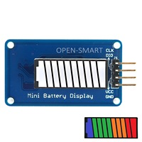

Battery Charger Display
-------

> ws://localhost:42013

# Components
* Arduino nano
* Open Smart 10-segment LED Bar Battery Display

# Commands
* Send battery state in %
* /status: get battery state.
